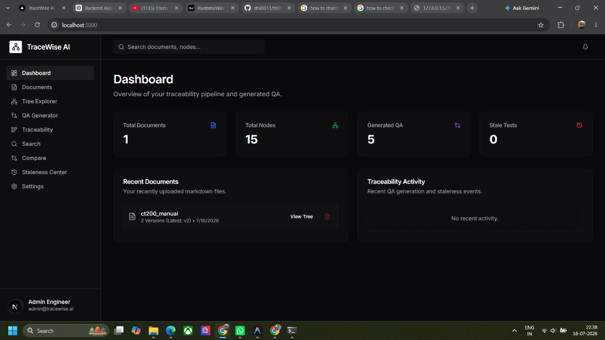
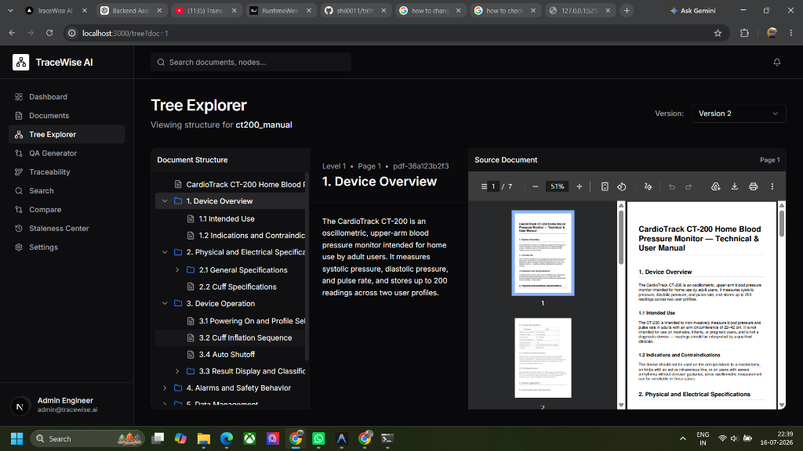
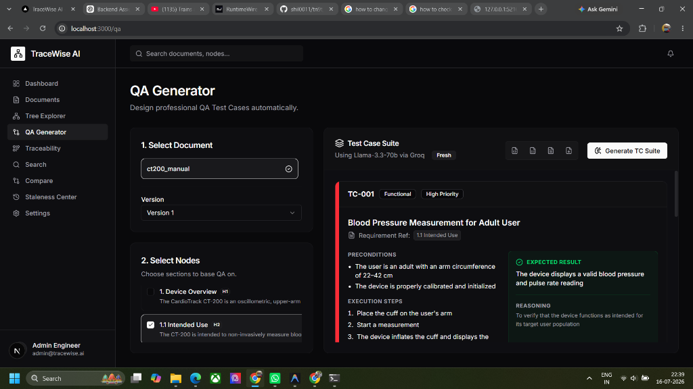
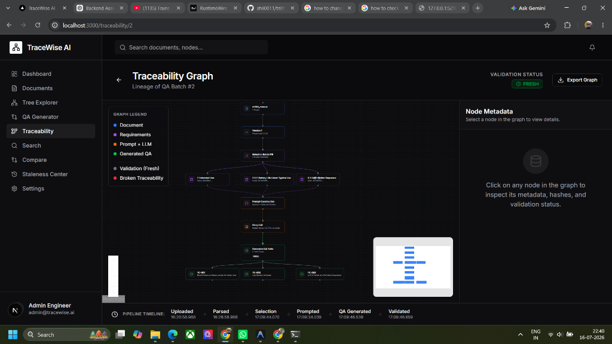
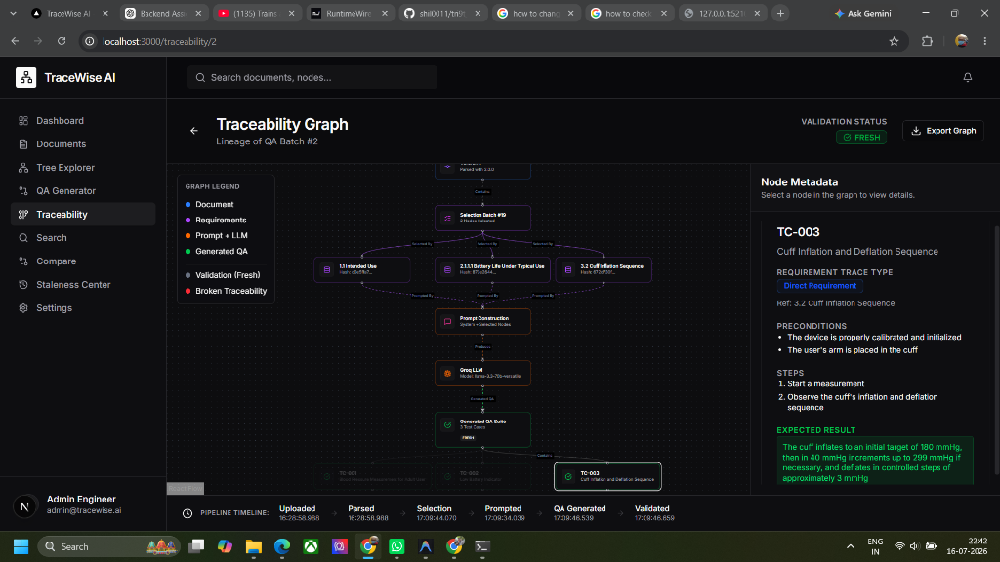

# TraceWise AI

**AI-Powered Medical Documentation QA & Traceability Platform**

TraceWise AI is an end-to-end regulated engineering platform that ingests technical documentation (PDF, DOCX, Markdown), parses it into a structured requirement hierarchy, generates professional QA test cases using Groq LLMs, and provides full forward and backward traceability—from document → version → requirement → prompt → LLM → test case—with built-in staleness detection and version comparison.

---

## Screenshots

### Dashboard
The main dashboard provides an at-a-glance overview of the traceability pipeline — total documents, parsed nodes, generated QA test cases, and stale test counts. Recently uploaded documents are listed with quick access to their tree views.



### Tree Explorer
The Tree Explorer displays the parsed hierarchical structure of any uploaded document. Users can browse sections, subsections, and leaf nodes in a collapsible tree view. Selecting a node reveals its extracted content, content hash, and page number. A side-by-side embedded PDF viewer shows the original source document for verification.



### QA Generator
The QA Generator allows users to select specific requirement nodes from the document tree and generate professional QA test cases via Groq LLM. Each generated test case includes a title, requirement reference, priority, category, preconditions, execution steps, expected result, and reasoning — all formatted for regulatory compliance.



### Traceability Graph
The Traceability Graph provides a complete visual lineage of the QA generation pipeline — from the source PDF document through version parsing, node selection, prompt construction, Groq LLM invocation, and finally to the generated QA test suite. The graph includes a validation status indicator, a pipeline timeline, and an export function.



### Traceability Graph — Node Inspection
Clicking on any node in the traceability graph opens a detailed metadata panel on the right. For test case nodes, this includes the requirement trace type, preconditions, execution steps, and expected results. Path highlighting dims unrelated nodes to focus on the selected node's lineage chain.



---

## Table of Contents

- [Architecture Overview](#architecture-overview)
- [Tech Stack](#tech-stack)
- [Project Structure](#project-structure)
- [Database Schema](#database-schema)
- [Backend Deep Dive](#backend-deep-dive)
  - [Entry Point](#entry-point)
  - [Routers (API Endpoints)](#routers-api-endpoints)
  - [Services](#services)
  - [PDF Parser Pipeline](#pdf-parser-pipeline)
- [Frontend Deep Dive](#frontend-deep-dive)
  - [Pages](#pages)
  - [Feature Components](#feature-components)
  - [API Layer](#api-layer)
- [Getting Started](#getting-started)
  - [Prerequisites](#prerequisites)
  - [API Key Setup](#api-key-setup)
  - [Backend Setup](#backend-setup)
  - [Frontend Setup](#frontend-setup)
  - [Running the Application](#running-the-application)
- [API Reference](#api-reference)
- [Core Workflows](#core-workflows)

---

## Architecture Overview

```
┌─────────────────────────────────────────────────────────────────────┐
│                        Frontend (Next.js)                          │
│  Dashboard │ Documents │ Tree │ QA │ Traceability │ Compare │ ...  │
└────────────────────────────┬────────────────────────────────────────┘
                             │ HTTP (axios)
                             ▼
┌─────────────────────────────────────────────────────────────────────┐
│                      Backend (FastAPI)                              │
│                                                                     │
│  Routers: documents │ generation │ compare │ staleness              │
│  Services: groq_service │ markdown_parser │ staleness_engine        │
│  Parser:  PDF Pipeline (loader → extractor → hierarchy → export)   │
└────────────────────────────┬────────────────────────────────────────┘
                             │
              ┌──────────────┼──────────────┐
              ▼              ▼              ▼
         SQLite DB      Groq API      File Storage
       (tracewise.db)   (LLM calls)   (uploads/)
```

---

## Tech Stack

| Layer     | Technology                                                                   |
|-----------|-----------------------------------------------------------------------------|
| Frontend  | Next.js 16, React 19, TypeScript, Tailwind CSS 4, Radix UI, React Flow     |
| Backend   | Python, FastAPI, Uvicorn, SQLAlchemy, Pydantic                              |
| Database  | SQLite (via SQLAlchemy ORM)                                                 |
| LLM       | Groq API (Llama 3.3 70B default)                                           |
| PDF Parse | PyMuPDF (fitz), pdfplumber, pytesseract (OCR fallback)                      |
| State     | TanStack React Query (server state), React useState (local state)            |

---

## Project Structure

```
tracewise-ai/
├── backend/
│   ├── app/
│   │   ├── main.py                    # FastAPI app entry point
│   │   ├── database.py                # SQLAlchemy engine & session
│   │   ├── models.py                  # ORM models (Document, Version, Node, etc.)
│   │   ├── schemas.py                 # Pydantic request/response schemas
│   │   ├── routers/
│   │   │   ├── documents.py           # Upload, list, delete, search documents
│   │   │   ├── generation.py          # Create selections, generate QA, traceability
│   │   │   ├── compare.py             # Version diff comparison
│   │   │   └── staleness.py           # Staleness detection & dashboard data
│   │   ├── services/
│   │   │   ├── groq_service.py        # Groq LLM integration for QA generation
│   │   │   ├── markdown_parser.py     # Markdown → hierarchical ParsedNode tree
│   │   │   └── staleness_engine.py    # Content-hash based stale detection engine
│   │   └── parser/
│   │       └── pdf/
│   │           ├── __init__.py         # Exports parse_pdf, tree_to_markdown
│   │           ├── loader.py           # Main PDF parse orchestrator
│   │           ├── text_extractor.py   # Raw text extraction from PDF pages
│   │           ├── heading_detector.py # Detects section headings via font analysis
│   │           ├── hierarchy_builder.py# Builds parent-child node tree
│   │           ├── layout_extractor.py # Extracts page layout and text blocks
│   │           ├── list_detector.py    # Detects bulleted/numbered lists
│   │           ├── table_detector.py   # Detects tables in PDF pages
│   │           ├── table_parser.py     # Parses detected tables
│   │           ├── ocr.py              # OCR fallback for scanned pages
│   │           ├── validator.py        # Validates parsed tree structure
│   │           ├── markdown_converter.py # Converts node tree → markdown string
│   │           ├── exporter.py         # Export utilities
│   │           └── models.py           # PDF parser data models
│   ├── requirements.txt               # Python dependencies
│   ├── .env_example                    # Environment variable template
│   └── uploads/                        # Uploaded document file storage
│
├── frontend/
│   ├── src/
│   │   ├── app/
│   │   │   ├── page.tsx               # Dashboard (home page)
│   │   │   ├── layout.tsx             # Root layout with sidebar
│   │   │   ├── globals.css            # Global styles and CSS variables
│   │   │   ├── documents/page.tsx     # Document upload & management
│   │   │   ├── tree/page.tsx          # Tree Explorer (hierarchical node viewer)
│   │   │   ├── qa/page.tsx            # QA Generator (select nodes → generate tests)
│   │   │   ├── traceability/page.tsx  # Traceability listing
│   │   │   ├── traceability/[id]/page.tsx # Interactive Traceability Graph (React Flow)
│   │   │   ├── compare/page.tsx       # Version Comparison with DiffViewer
│   │   │   ├── staleness/page.tsx     # Staleness Analysis Dashboard
│   │   │   ├── search/page.tsx        # Full-text search across nodes
│   │   │   └── settings/page.tsx      # Settings page
│   │   ├── components/
│   │   │   ├── layout/
│   │   │   │   ├── main-layout.tsx    # App shell (sidebar + content area)
│   │   │   │   └── sidebar.tsx        # Navigation sidebar
│   │   │   ├── features/
│   │   │   │   ├── tree-explorer.tsx   # Collapsible requirement tree component
│   │   │   │   ├── pdf-viewer.tsx      # Embedded PDF viewer (iframe)
│   │   │   │   ├── diff-viewer.tsx     # Word-level diff viewer component
│   │   │   │   └── traceability-panel.tsx # Traceability side panel
│   │   │   ├── ui/                    # shadcn/ui components (Button, Card, etc.)
│   │   │   ├── TraceNode.tsx          # Custom React Flow node for traceability graph
│   │   │   └── providers.tsx          # React Query + Theme providers
│   │   └── lib/
│   │       ├── api.ts                 # Axios client, React Query hooks, TypeScript types
│   │       ├── dagre.ts               # Dagre graph layout utility for React Flow
│   │       └── utils.ts              # Utility functions (cn, etc.)
│   ├── package.json
│   └── tsconfig.json
│
├── .gitignore
└── README.md
```

---

## Database Schema

TraceWise uses SQLite with the following entity-relationship model:

```
┌──────────────┐     1:N     ┌──────────────┐     1:N     ┌──────────────┐
│   Document   │────────────▶│   Version    │────────────▶│     Node     │
│              │             │              │             │              │
│ id           │             │ id           │             │ id           │
│ title        │             │ document_id  │             │ version_id   │
│ created_at   │             │ version_num  │             │ node_id      │
│ source_type  │             │ raw_markdown │             │ level        │
│ original_    │             │ page_count   │             │ title        │
│   filename   │             │ processing_  │             │ body         │
└──────────────┘             │   time       │             │ content_hash │
                             │ ocr_used     │             │ parent_id    │
                             │ parser_      │             │ page_number  │
                             │   version    │             │ node_type    │
                             └──────────────┘             └──────┬───────┘
                                    │                            │
                                    │ 1:N                   N:M (via SelectionNode)
                                    ▼                            ▼
                             ┌──────────────┐             ┌──────────────┐
                             │  Generation  │◀────────────│  Selection   │
                             │              │    N:1      │              │
                             │ id           │             │ id           │
                             │ selection_id │             │ name         │
                             │ version_id   │             │ created_at   │
                             │ model        │             └──────────────┘
                             │ prompt       │                    │
                             │ output (JSON)│             ┌──────────────┐
                             │ is_stale     │             │SelectionNode │
                             │ stale_reason │             │              │
                             │ created_at   │             │ selection_id │
                             └──────────────┘             │ node_id      │
                                                          └──────────────┘
```

### Key Relationships

| Relationship | Description |
|---|---|
| **Document → Version** | One document can have multiple versions (v1, v2, v3...). Uploading a file with a matching normalized filename auto-increments the version. |
| **Version → Node** | Each version is parsed into a hierarchical tree of nodes. Each node has a `content_hash` (SHA-256) for change detection. |
| **Node → Node** | Self-referential parent-child relationship forming the document's section hierarchy. |
| **Selection → Node** | A selection is a user-defined group of nodes chosen for QA generation (many-to-many via `SelectionNode`). |
| **Generation → Selection** | Each QA generation is linked to the selection of nodes that was used as input. |
| **Generation → Version** | Each generation is tied to the specific document version it was generated against. |

---

## Backend Deep Dive

### Entry Point

**`app/main.py`** — Initializes the FastAPI application, loads environment variables from `.env`, configures CORS middleware, creates database tables, and registers all routers under the `/api` prefix.

```python
app.include_router(documents.router, prefix="/api")
app.include_router(generation.router, prefix="/api")
app.include_router(staleness.router, prefix="/api")
app.include_router(compare.router, prefix="/api")
```

### Routers (API Endpoints)

#### 1. Documents Router (`routers/documents.py`)

Handles document lifecycle: upload, retrieval, search, and deletion.

| Method | Endpoint | Description |
|--------|----------|-------------|
| `POST` | `/api/documents/upload` | Upload a PDF/DOCX/Markdown file. Auto-detects if it belongs to an existing document (via normalized filename matching) and creates a new version instead of a new document. |
| `GET` | `/api/documents` | List all documents with their versions. |
| `GET` | `/api/documents/{id}` | Get a single document by ID. |
| `GET` | `/api/documents/{id}/versions` | List all versions of a document. |
| `GET` | `/api/documents/{id}/file` | Download the original uploaded file. |
| `DELETE` | `/api/documents/{id}` | Delete a document and all associated versions, nodes, selections, and generations. |
| `GET` | `/api/versions/{id}/nodes` | Get all parsed nodes for a specific version. |
| `GET` | `/api/versions/{id}/file` | Download the file for a specific version. |
| `GET` | `/api/versions` | List versions, optionally filtered by `doc_id`. |
| `GET` | `/api/nodes` | List all nodes (limit 1000). |
| `GET` | `/api/nodes/{id}` | Get a single node by ID. |
| `GET` | `/api/search?q=` | Full-text search across node titles and bodies. |

**Upload Flow (Versioning Logic):**
1. The uploaded filename is normalized by stripping version suffixes (`_v1`, `_v2`, `-version3`, etc.).
2. Existing documents are searched by exact title match or normalized filename match.
3. If a match is found → a new `Version` is created under the existing `Document` (auto-incrementing `version_num`).
4. If no match → a new `Document` and its first `Version` are created.
5. The file content is parsed (PDF → structured tree, DOCX → markdown → tree, MD → tree).
6. Parsed nodes are recursively inserted into the database with their content hashes.

---

#### 2. Generation Router (`routers/generation.py`)

Handles requirement selection, QA test case generation via Groq, and traceability graph retrieval.

| Method | Endpoint | Description |
|--------|----------|-------------|
| `POST` | `/api/selections` | Create a named selection of nodes (requirement grouping for QA input). |
| `GET` | `/api/selections` | List all selections. |
| `GET` | `/api/selections/{id}` | Get a selection with its linked nodes. |
| `POST` | `/api/generate` | Generate QA test cases. Takes `selection_id`, `version_id`, and `model` name. Calls Groq LLM and stores the structured JSON output. |
| `GET` | `/api/generations` | List all generations (summary view). |
| `GET` | `/api/generations/{id}` | Get a single generation with full JSON output. |
| `GET` | `/api/traceability/{gen_id}` | Get the complete traceability graph for a generation — includes document metadata, parsed nodes, selection info, prompt, LLM output, staleness status, and performance metrics. |

**QA Generation Flow:**
1. User selects requirement nodes from the tree → creates a `Selection`.
2. User triggers generation → the backend concatenates the selected nodes' markdown.
3. The combined markdown is sent to Groq with a carefully engineered prompt that enforces structured JSON output containing: `title`, `requirement_reference`, `priority`, `category`, `preconditions`, `steps`, `expected_result`, and `reasoning`.
4. The response is validated against a Pydantic schema (`TestCaseList`). If validation fails, one automatic retry is attempted.
5. Traceability metadata (node IDs, hashes, version, model) is embedded into the output and stored as a `Generation` record.

---

#### 3. Compare Router (`routers/compare.py`)

Performs node-level diffing between two document versions.

| Method | Endpoint | Description |
|--------|----------|-------------|
| `GET` | `/api/versions/compare?old_version_id=X&new_version_id=Y` | Compare two versions node-by-node. Returns summary counts (added/deleted/modified) and per-node diffs with old/new content. |

**Comparison Logic:**
- Nodes are matched by their deterministic `node_id` (based on heading text and position).
- A `normalize_text()` function collapses all whitespace before comparison, preventing false positives from PDF extraction artifacts.
- Each node is classified as: `added`, `deleted`, `modified`, or `unchanged`.

---

#### 4. Staleness Router (`routers/staleness.py`)

Detects stale QA generations and provides a comprehensive dashboard API.

| Method | Endpoint | Description |
|--------|----------|-------------|
| `POST` | `/api/staleness/check?old_version_id=X&new_version_id=Y` | Run staleness detection. Compares content hashes between versions and flags affected generations as stale. |
| `GET` | `/api/staleness/{gen_id}` | Get staleness status for a specific generation. |
| `GET` | `/api/staleness/dashboard/data?old_version_id=X&new_version_id=Y` | Returns full dashboard payload: summary metrics, changed requirements with old/new content, and affected QA items with severity and recommended actions. |

**Dashboard Data Logic:**
- Cross-references each test case's `requirement_reference` against actually-changed nodes.
- Filters out false-positive staleness caused by whitespace-only changes.
- Assigns severity levels: `High` (deleted node) → `Medium` (modified node) → `Low` (added node).
- Generates recommended actions: "Regenerate Test Case", "Review Expected Result", etc.

---

### Services

#### `services/groq_service.py`
Wraps the Groq API client. Sends a structured prompt to the LLM requesting professional QA test cases in strict JSON format. Uses `temperature=0.2` for deterministic output and `response_format={"type": "json_object"}` for guaranteed JSON. Includes automatic retry on validation failure.

#### `services/markdown_parser.py`
Parses raw markdown text into a hierarchical tree of `ParsedNode` objects. Detects headings (`#` through `######`), assigns deterministic `node_id`s (MD5-based), and computes bottom-up SHA-256 content hashes that include children's hashes for Merkle-tree-style change propagation.

#### `services/staleness_engine.py`
Compares content hashes between old and new version nodes. For each generation that hasn't already been flagged, checks whether any of its linked nodes (via selections) have been modified or deleted in the new version. Stores per-node stale reasons as JSON.

---

### PDF Parser Pipeline

The PDF parser (`app/parser/pdf/`) is a multi-stage pipeline:

```
PDF File
  │
  ▼
loader.py (orchestrator)
  │
  ├──▶ text_extractor.py    → Extract raw text per page
  ├──▶ layout_extractor.py  → Analyze page layout and text blocks
  ├──▶ heading_detector.py  → Identify section headings via font size/weight
  ├──▶ list_detector.py     → Detect bulleted and numbered lists
  ├──▶ table_detector.py    → Detect tables in pages
  ├──▶ table_parser.py      → Parse detected table structures
  ├──▶ ocr.py               → OCR fallback for scanned/image pages
  │
  ▼
hierarchy_builder.py → Build parent-child node tree from detected headings
  │
  ▼
validator.py → Validate tree structure (heading jumps, empty headings)
  │
  ▼
markdown_converter.py → Convert tree → markdown string
  │
  ▼
Returns: (List[ParsedNode], metadata_dict)
```

**Key Features:**
- Font-based heading detection (not regex-only)
- OCR fallback for scanned documents
- Deterministic node IDs for cross-version tracking
- Page number tracking per node
- Content hash computation for change detection

---

## Frontend Deep Dive

### Pages

| Page | Route | Description |
|------|-------|-------------|
| **Dashboard** | `/` | Overview with summary stats (total documents, nodes, QA generated, stale tests) and recent document list. |
| **Documents** | `/documents` | Upload new documents (PDF/DOCX/MD), view all documents with version counts, delete documents. |
| **Tree Explorer** | `/tree?doc={id}` | Interactive hierarchical tree view of parsed document nodes. Select a version from a dropdown, browse sections, view node content with content hashes and page numbers. Includes an embedded PDF viewer side-by-side. |
| **QA Generator** | `/qa` | Select requirement nodes → create a selection → generate QA test cases via Groq LLM. View generated test cases with title, priority, category, steps, expected results, and reasoning. |
| **Traceability Graph** | `/traceability/{id}` | Interactive React Flow graph showing the full traceability chain: Document → Version → Selection → Requirements → Prompt → Groq → QA Suite → Test Cases. Includes validation summary panel and metadata. |
| **Traceability List** | `/traceability` | Lists all QA generations with staleness indicators. Click to view the traceability graph. |
| **Version Comparison** | `/compare` | Select two versions of the same document. View a word-level diff of every changed requirement using the DiffViewer component. Summary shows counts of added/deleted/modified nodes. |
| **Staleness Center** | `/staleness` | Full staleness analysis dashboard with summary metric cards, requirement impact table, affected QA table with severity and recommended actions, and interactive trace modal showing requirement diffs. Supports export to PDF, Markdown, and JSON. |
| **Search** | `/search` | Full-text search across all parsed nodes. Displays matching nodes with highlighted context. |
| **Settings** | `/settings` | Application settings page. |

### Feature Components

| Component | File | Description |
|-----------|------|-------------|
| **TreeExplorer** | `components/features/tree-explorer.tsx` | Recursive, collapsible tree component for browsing document hierarchy. Shows node title, level, content hash, and body text. |
| **PDFViewer** | `components/features/pdf-viewer.tsx` | Embedded PDF viewer using an iframe pointed at the backend's file serving endpoint. |
| **DiffViewer** | `components/features/diff-viewer.tsx` | Word-level difference visualization. Uses the `diff` npm package. Additions in green, deletions in red. |
| **TraceabilityPanel** | `components/features/traceability-panel.tsx` | Side panel showing traceability details for a selected node or generation. |
| **TraceNode** | `components/TraceNode.tsx` | Custom React Flow node component used in the traceability graph. Styled with the application's dark theme. |
| **Sidebar** | `components/layout/sidebar.tsx` | Application navigation sidebar with links to all pages. |
| **MainLayout** | `components/layout/main-layout.tsx` | App shell that combines sidebar + scrollable content area. |

### API Layer

**`lib/api.ts`** centralizes all backend communication:

- **Axios Instance**: Pre-configured with `baseURL = http://localhost:8000/api`
- **TypeScript Interfaces**: Full type definitions for `Document`, `Version`, `Node`, `Generation`, `TraceabilityGraph`, `StalenessDashboardData`
- **React Query Hooks**:
  - `useDocuments()` — Fetch all documents
  - `useVersionNodes(versionId)` — Fetch nodes for a version
  - `useUploadDocument()` — Upload mutation
  - `useDeleteDocument()` — Delete mutation
  - `useCreateSelection()` — Create selection mutation
  - `useGenerateQA()` — Generate QA mutation
  - `useCheckStaleness()` — Run staleness check mutation
  - `useCompareVersions(oldId, newId)` — Compare two versions
  - `useStalenessDashboard(oldId, newId)` — Fetch dashboard data
  - `useTraceability(genId)` — Fetch traceability graph
  - `useSearch(query)` — Search nodes
  - `useSelections()` — Fetch all selections
  - `useStaleness(genId)` — Fetch staleness for a generation

---

## Getting Started

### Prerequisites

- **Python 3.10+** — [Download Python](https://www.python.org/downloads/)
- **Node.js 18+** — [Download Node.js](https://nodejs.org/)
- **npm** (comes with Node.js)
- **Groq API Key** — [Get a free key at console.groq.com](https://console.groq.com/)

### API Key Setup

1. Navigate to the `backend/` directory.
2. Copy the example environment file:
   ```bash
   cp .env_example .env
   ```
3. Open `.env` and replace the placeholder with your actual Groq API key:
   ```env
   GROQ_API_KEY=gsk_your_actual_groq_api_key_here
   ```

> **Important:** Never commit your `.env` file. It is already listed in `.gitignore`.

### Backend Setup

```bash
# Navigate to the backend directory
cd backend

# Create a Python virtual environment
python -m venv venv

# Activate the virtual environment
# On Windows:
venv\Scripts\activate
# On macOS/Linux:
source venv/bin/activate

# Install dependencies
pip install -r requirements.txt
```

### Frontend Setup

```bash
# Navigate to the frontend directory
cd frontend

# Install Node.js dependencies
npm install
```

### Running the Application

You need **two terminal windows** — one for the backend, one for the frontend.

**Terminal 1 — Start the Backend:**

```bash
cd backend
# Activate virtual environment if not already active
venv\Scripts\activate        # Windows
# source venv/bin/activate   # macOS/Linux

# Start the FastAPI server with hot-reload
python -m uvicorn app.main:app --reload --port 8000
```

The backend API will be running at: **http://localhost:8000**

You can access the auto-generated API docs at: **http://localhost:8000/docs**

**Terminal 2 — Start the Frontend:**

```bash
cd frontend

# Start the Next.js development server
npm run dev
```

The frontend will be running at: **http://localhost:3000**

---

## API Reference

### Health Check

```
GET /health
→ { "status": "ok" }
```

### Documents

```
POST   /api/documents/upload        — Upload document (multipart form: title + file)
GET    /api/documents               — List all documents
GET    /api/documents/{id}          — Get document by ID
GET    /api/documents/{id}/versions — List versions of a document
GET    /api/documents/{id}/file     — Download document file
DELETE /api/documents/{id}          — Delete document and all related data
```

### Versions & Nodes

```
GET    /api/versions                — List versions (optional: ?doc_id=)
GET    /api/versions/{id}/nodes     — Get nodes for a version
GET    /api/versions/{id}/file      — Download version-specific file
GET    /api/nodes                   — List all nodes (limit 1000)
GET    /api/nodes/{id}              — Get node by ID
GET    /api/search?q=               — Search nodes by title/body
```

### QA Generation

```
POST   /api/selections              — Create a selection of nodes
GET    /api/selections              — List all selections
GET    /api/selections/{id}         — Get selection with nodes
POST   /api/generate                — Generate QA test cases (body: selection_id, version_id, model)
GET    /api/generations             — List all generations
GET    /api/generations/{id}        — Get generation with output
GET    /api/traceability/{gen_id}   — Get full traceability graph
```

### Version Comparison

```
GET    /api/versions/compare?old_version_id=X&new_version_id=Y — Diff two versions
```

### Staleness

```
POST   /api/staleness/check?old_version_id=X&new_version_id=Y  — Run staleness detection
GET    /api/staleness/{gen_id}                                  — Get staleness for a generation
GET    /api/staleness/dashboard/data?old_version_id=X&new_version_id=Y — Full dashboard data
```

---

## Core Workflows

### 1. Document Upload & Parsing

```
User uploads PDF/DOCX/MD file
         │
         ▼
   Filename normalized → Check for existing document
         │
    ┌────┴────┐
    ▼         ▼
 New Doc   Existing Doc
 (v1)      (auto v2, v3...)
    │         │
    └────┬────┘
         ▼
   File parsed → Node tree created
         │
         ▼
   Nodes stored with content hashes
```

### 2. QA Test Case Generation

```
User selects requirement nodes from tree
         │
         ▼
   Creates a Selection (named group)
         │
         ▼
   Triggers /api/generate
         │
         ▼
   Backend builds markdown from selected nodes
         │
         ▼
   Sends to Groq LLM with structured prompt
         │
         ▼
   Validates JSON response (with retry)
         │
         ▼
   Stores Generation with traceability metadata
```

### 3. Staleness Detection

```
User uploads new version of a document
         │
         ▼
   Triggers staleness check (old_v vs new_v)
         │
         ▼
   Engine compares content_hash of each node
         │
         ▼
   Flags generations linked to changed nodes
         │
         ▼
   Dashboard shows: which tests are stale,
   why they're stale, and recommended actions
```

---

## License

This project was built as an assignment project.
